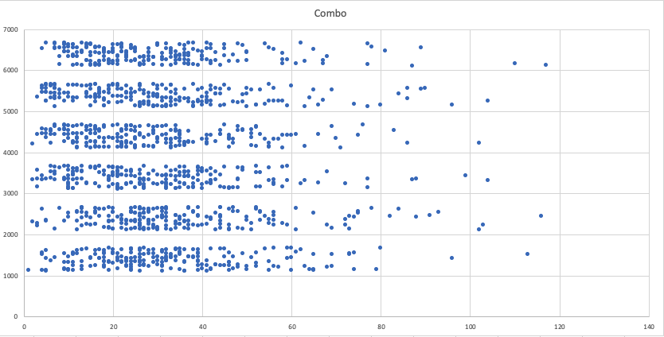

# Mastermind

## My implementation of the Mastermind board game in Ruby

### I have used OOP where possible, and I am open to constructive criticism on how to improve :)

### Players can try and solve the puzzle vs the CPU, or have the CPU try and solve their code

### Currently the win rate for the CPU (i.e guess the correct code within 12 turns is 14.38%)

### Please find distribution of the turns taken to solve each combination.

### I am working to implement a 'hard CPU' that uses the minimax formula as described by Donald Knuth

[Link to Donald Knuth Article](http://www.cs.uni.edu/~wallingf/teaching/cs3530/resources/knuth-mastermind.pdf)

